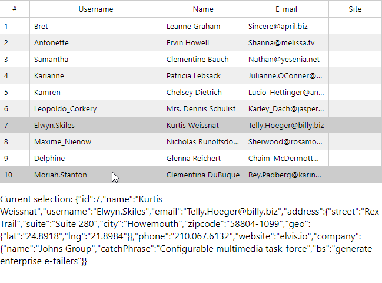

# react-simpletable

> Simple table component to render json data from local or remote

[](https://www.npmjs.com/package/react-simpletable)
[](https://standardjs.com)

[See live examples here](https://hesenger.com/react-simpletable).

All size of projects needed powerfull and customizable components, but data
driven software usually have many CRUDS to simple manage data in single tables, 
in this case, productivity comes to be a good partner, and a simple declarative 
component to list local or remote data is a must.

In this cases `react-simpletable` is a fast option to show users data and let them 
select wich they want to change/delete.

[See detailed example at /example](example).



The default style (gray based) not set `font-face` or `font-size`, this 
will be inherited from your documents defaults. To set colors or other styles 
use .simpletable class like:

```
#root .simpletable tr:nth-child(even) { background-color: #e8f5d7; }
#root .simpletable tr.active { background-color: #fae6aa; }
#root .simpletable tr:hover td, tr.active:hover td { background-color: #d7faaa; }
```

Remember that table is not rendered directly to page, this is inside a `section` tag, 
with css class `simpletable` name.


## Remote tables with simple `url` property

Version 0.2 featured remote data based tables with simple `url` property see
[example](example).


## Install

```bash
npm i @hesenger/react-simpletable
```

## Usage

```jsx
import React from 'react';
import ReactDOM from 'react-dom';
import Table from 'react-simpletable';
import 'react-simpletable/dist/index.css';

const App = () => {
  const [data, setData] = React.useState([]);
  const [current, setCurrent] = React.useState();

  if (!data.length)
    fetch('https://jsonplaceholder.typicode.com/users')
      .then(resp => resp.json())
      .then(data => setData(data));

  return <>
    <Table data={data} onSelect={row => setCurrent(row)}>
      <Table.Col name="id" header="#" />
      <Table.Col name="username" header="Username" />
      <Table.Col name="name" header="Name" />
      <Table.Col name="email" header="E-mail" />
      <Table.Col header="Site" format={obj => <a href={'http://' + obj.website}>{obj.website}</a>} />
    </Table>
    <p>
      Current selection: {JSON.stringify(current)}
    </p>
  </>;
}

ReactDOM.render(<App />, document.getElementById('root'))
```

## License

MIT © [hesenger](https://github.com/hesenger)
